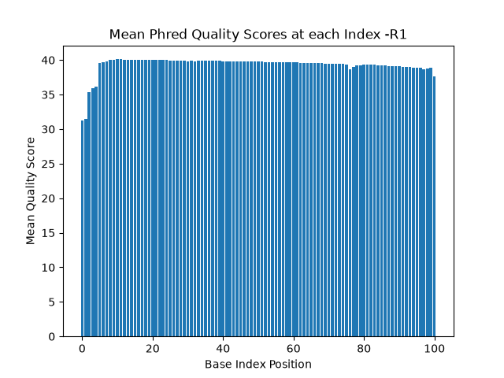
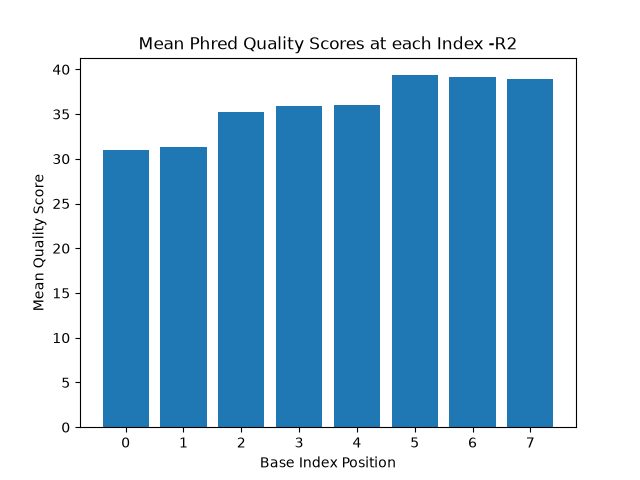
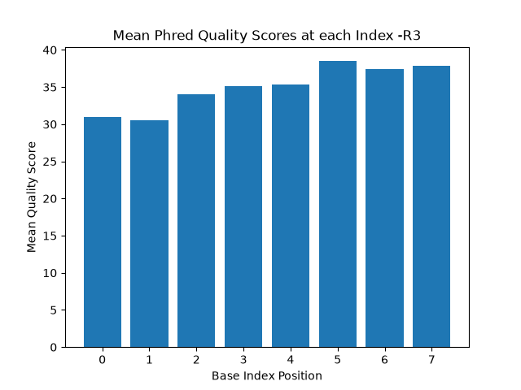
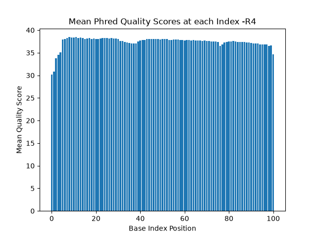

# Assignment the First

## Part 1
1. Be sure to upload your Python script. Provide a link to it here: [histogram.py](histogram.py)

```zcat 1294_S1_L008_R1_001.fastq.gz | head -2 | tail -1 | wc```

| File name | label | Read length | Phred encoding |
|---|---|---|---|
| 1294_S1_L008_R1_001.fastq.gz |read 1|101|33|
| 1294_S1_L008_R2_001.fastq.gz |index 1|8|33|
| 1294_S1_L008_R3_001.fastq.gz |index 2|8|33|
| 1294_S1_L008_R4_001.fastq.gz |read 2|101|33|

The Phred encoding is 33 because the # sign is present and represents the N or unknown values. This is only a Phred letter encoding in base 33.

2. Per-base NT distribution
    1. Use markdown to insert your 4 histograms here.




    
3) What is a good quality score cutoff for index reads and biological read pairs to utilize for sample identification and downstream analysis, respectively? Justify your answer.

I chose the cut off to be a quality score of 20. This results in a perror of 1%. Since the HAMing distance of the barcodes is 3bp there is a super low chance of a barcode being misaligned with another barcode on accident and thus barcodes would be less likely to be misaligned to the wrong group (hopped, matched, unknown).This seemed like a reasonable cut off, I was considering Q30 but that seemed overkill. I thought a cutoff of Q30 would bin alot of data to incorrect places because it is taking too much data in that cut off.

4)	How many indexes have undetermined (N) base calls? (Utilize your command line tool knowledge. Submit the command(s) you used. CHALLENGE: use a one-line command)
input:
```zcat 1294_S1_L008_R2_001.fastq.gz 1294_S1_L008_R3_001.fastq.gz | awk 'NR%4==2' | grep -c "N"```
output: 7304664
## Part 2
1. Define the problem
2. Describe output
3. Upload your [4 input FASTQ files](../TEST-input_FASTQ) and your [>=6 expected output FASTQ files](../TEST-output_FASTQ).
input files:
[inputR1.fq](inputR1.fq)
[inputR2.fq](inputR2.fq)
[inputR3.fq](inputR3.fq)
[inputR4.fq](inputR4.fq)
output files: 
[outputmatchedR1.fq](outputmatchedR1.fq)
[outputmatchedR2.fq](outputmatchedR2.fq)
[outputhoppedR1.fq](outputhoppedR1.fq)
[outputhoppedR2.fq](outputhoppedR2.fq)
[outputunknownR1.fq](outputunknownR1.fq)
[outputunknownR2.fq](outputunknownR2.fq)
4. Pseudocode
5. High level functions. For each function, be sure to include:
    1. Description/doc string
    2. Function headers (name and parameters)
    3. Test examples for individual functions
    4. Return statement
